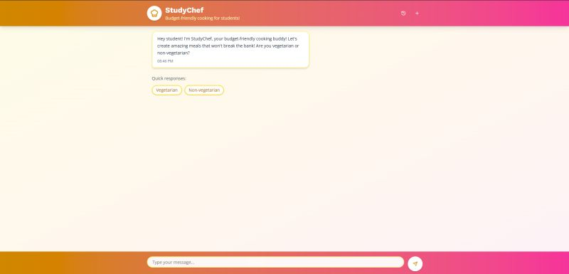

# 🍲 StudyChef – AI-Powered Budget Cooking Agent

> A smart, budget-friendly cooking assistant built to help students cook delicious, affordable meals — powered by AI.

---

## 🎯 Overview  
**StudyChef** is an intelligent cooking companion designed for **students living abroad, in hostels, or on tight budgets**.  
It helps you plan, cook, and manage meals that fit your time, taste, and wallet.

Think of it as **ChatGPT, but for cooking** — your personal kitchen assistant that plans your meals, suggests recipes, and helps you make the most out of every ingredient.

---

## 🧠 Key Features  
✅ **Budget-Based Meal Planning** – Set your monthly or weekly budget and get a tailored meal plan.  
✅ **Bulk Cooking Recipes** – Get 3–7-day batch-cooking ideas with storage & reheating guidance.  
✅ **Smart Substitutions** – Ingredient alternatives and leftover transformations.  
✅ **Global Cuisines** – Explore diverse recipes that stay within your budget.  
✅ **Nutrition Insights** – See calorie and nutrient breakdowns for every meal.  

---

## 🛠️ Tech Stack  
- **Frontend:** React.js (modern, minimal UI with gradient theme)  
- **Backend:** Node.js + Express  
- **AI Layer:** OpenAI API (for recipe generation and conversation)  
- **Database:** MongoDB (user data & preferences)  
- **Styling:** Tailwind CSS + Framer Motion animations  

---

## 🚀 How It Works  
1. The user interacts with a chatbot-style interface.  
2. StudyChef asks for dietary preference (Vegetarian / Non-Vegetarian).  
3. Based on budget & cuisine choice, it generates personalized meal plans and recipes.  
4. Future versions will include **pantry tracking** and **grocery price APIs**.

---

## 💡 Vision  
To make **independent living easier, healthier, and more sustainable** for students worldwide.  
StudyChef’s mission is simple — **feed both the stomach and the soul** with smart, affordable meals.

---

## 🎥 Demo Video  
📺 Watch here: [https://lnkd.in/ea2CbX5D](https://lnkd.in/ea2CbX5D)

---

## 🌍 Future Scope  
- 🧾 Grocery price integration APIs  
- 🧠 Pantry item detection & tracking  
- 📍 Local store and discount recommendations  
- 📱 Mobile app version with push notifications

---

## 🧑‍💻 Author  
**Developed by:** Hassan Ali
**LinkedIn:** [https://www.linkedin.com/in/hassanxl]  
**Email:** [workxl5801@gmail.com]

---

## 🏷️ License  
This project is licensed under the **MIT License** – see the [LICENSE](LICENSE) file for details.
